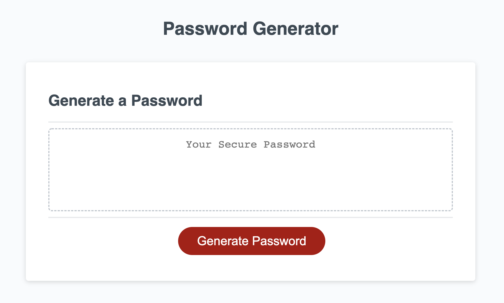

# Password Generator

## User Story

```
AS AN employee with access to sensitive data
I WANT to randomly generate a password that meets certain criteria
SO THAT I can create a strong password that provides greater security
```

## Website Description

```
The website is a password generator, it takes in the user's input of how many letters the user wants alongside the parameters (uppercased, lowercased, special characters) through a prompt.
```



```

```
